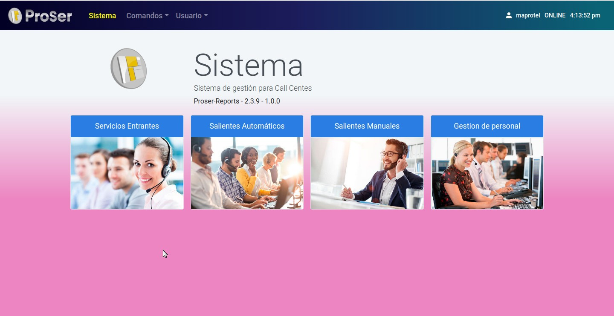
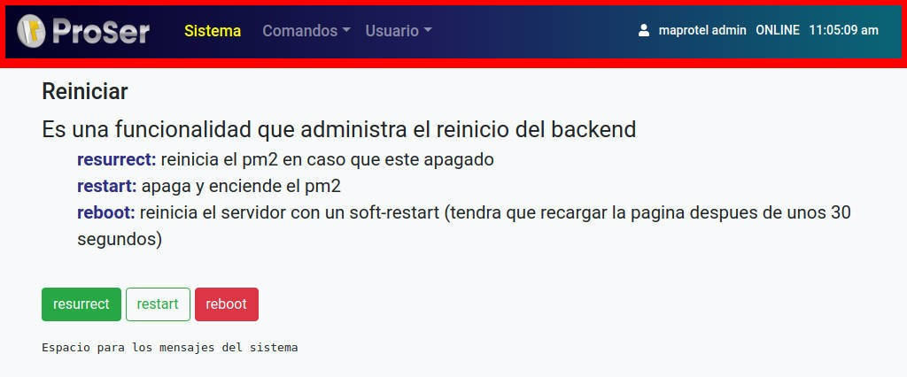
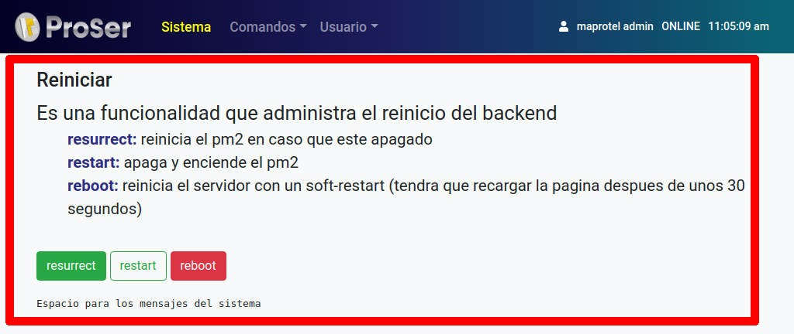
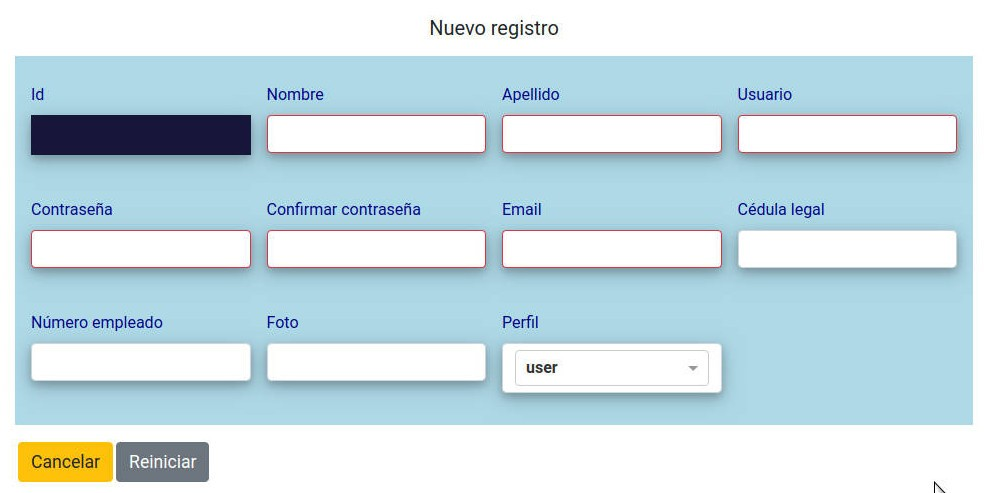
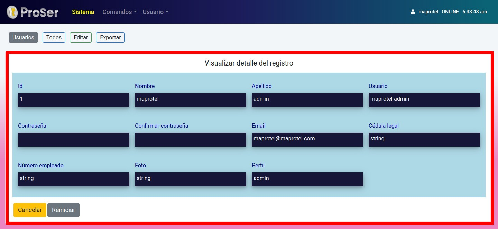
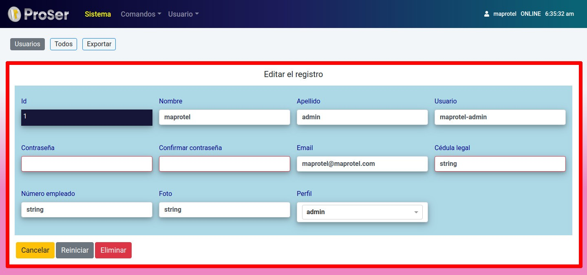

# Sistema
En este módulo el usuario al cual se le determinó internamente hacer las modificaciones en el sistema, puede ejecutar comando en la aplicación para iniciar nuevamente su funcionamiento si el mismo presenta inconvenientes. De igual manera puede también crear usuarios para ser asignados a los agentes a fin de que puedan tener acceso al aplicativo.  

Es oportuno destacar que si no puede visualizar este módulo es debido a su perfil de usuario, por lo tanto no puede procesar ninguna actividad dentro del mismo.

**
 Vista Módulo Sistema 
**

## Comandos para Reiniciar
El usuario de la reportería ProSer, a través de esta funcionalidad, puede reiniciar el sistema y el servidor para tomar acciones rápidas en caso de alguna falla en los servicios del sistema. Los usuarios con el perfil admin y system serán los responsables de gestionar y
ejecutar esta tarea. Así mismo, estos dos perfiles son lo únicos que pueden visualizar esta sección.

La vista se compone de 2 partes: menú superior y zona de acción.

### Menú superior
Se encuentra ubicado en la parte superior de la ventana y en él podemos
divisar: el logo de ProSer, el nombre del módulo, las opciones de las vistas que conforman el módulo, el nombre del usuario, el estado de conexión y la hora actual.

**
 Figura 1 - Menú Superior 
**

### Zona de acción
La zona de acción se caracteriza por poseer los botones de acción y la
leyenda que señala las tareas que ejecutan dichos botones. El usuario dispone de tres botones que ejecutan diferentes funciones:

- resurrect: reinicia el pm2 en caso que esté apagado.
- restar: apaga y enciende el pm2.
- reboot: reinicia el servidor con un soft-restart (tendrá que recargar la página después de 30 segundos).

*pm2 es el software que se encarga de administrar los servicios del
sistema. 

**
 Figura 2 - Zona de acción 
**

## Configuración usuario
El administrador del sistema puede gestionar los perfiles de los usuarios de la reportería ProSer a través de esta sección. Esta funcionalidad ofrece las opciones para crear, editar, eliminar y exportar los perfiles de usuario, permitiendo tener control sobre el acceso de las personas al sistema.

La vista de esta funcionalidad se divide en 3 grandes secciones que son: *menú superior, zona de botones y tabla de contenido*.

### Menú superior
El menú superior se encuentra ubicado en la parte superior de la ventana y dentro de él podemos divisar: el logo de ProSer, el nombre del módulo, las opciones de las vistas que conforman el módulo, el nombre del usuario, el estado de conexión y la hora actual.

**
 Figura 1 - Menú Superior 
**

### Zona de botones
Se ubica debajo del *menú superior* y contiene dos (2) secciones para
realizar las actividades inherentes a este módulo.

**
 Figura 2 - Zona de botones 
**

#### Sección uno
En esta sección se encuentra un indicador y tres (03) botones que
permiten llevar a cabo acciones características del módulo de configuración. Dichas acciones se relacionan con la vista, edición, creación y/o eliminación de la data. A continuación se explica cada botón de izquierda a derecha:

**
 Figura 3 - Zona de botones(Sección Uno) 
**

##### Nombre
Este indicador muestra el nombre de la sección del módulo en donde se encuentra el usuario, es decir, para este caso usted está en la subsección **Usuarios** dentro de la sección **Usuarios** perteneciente al módulo de **Sistema**.

##### Todos
Al ejecutar el botón *“Todos”* se desplegará en la tabla de
contenido la totalidad de los usuarios creados sin importar el
estado en el que se encuentren.

##### Nuevo
Sirve para generar un nuevo registro. Al hacer clic sobre *“Nuevo”*, la vista cambiará a un formulario que mostrará los campos a rellenar para hacer posible la creación de un nuevo usuario.

**
 Figura 4 - Zona de botones(Nuevo) 
**

##### Exportar
Al hacer clic sobre el botón exportar, automáticamente se iniciará la descargar de un archivo, en formato CSV, con el todo el contenido de los perfiles de los usuarios.

#### Sección Dos
Esta sección está dividida en tres (3) partes que abarca el
siguiente contenido:

**
 Figura 5 - Zona de botones(Sección Dos) 
**

##### Selector de dato
Establece el parámetro a través del cual se realizará la búsqueda. Es decir, podemos especificar la búsqueda de registros por Id, Nombre, Apellido, Usuario, Perfil, Email, Cédula legal, Número empleado y Foto.

##### Buscador
Dentro de esta barra se coloca el dato que se quiere conseguir en los registros. Se debe tomar en cuenta el parámetro establecido en el *selector de dato*.

##### Selector de cantidad de registros
Para la comodidad del usuario en las vista de los registros, este selector permite establecer el número de filas que desea visualizar en la tabla de contenido.

### Tabla de contenido
Dentro de la *tabla de contenido* se despliega la información
correspondiente a los datos configurados del módulo. La información expuesta variará de acuerdo a la ejecución, que haga el usuario, de cada botón. Para el caso de la vista general se muestra la información con base en los siguientes campos:

**
 Figura 6 - Tabla de Contenido 
**

#### Id
Identificador que se incremente automáticamente al crear un
nuevo registro, y sirve para identificar cada dato existente.

#### Nombre
Indica el nombre real del usuario existente o creado.

#### Apellido
Indica el apellido real del usuario.

#### Usuario
Indica el nombre de usuario para iniciar sesión en el sistema.

#### Perfil
Indica el perfil asociado al usuario. Los 
perfiles disponibles son:

- Admin: El usuario admin tiene la posibilidad de gestionar la totalidad del sistema.

- System: El usuario system únicamente tiene acceso al módulo de sistema y a los módulos generales (reportes,dashboard, display).

- Config: El usuario config únicamente tiene acceso al módulo de configuración y a los módulos generales (reportes, dashboard, display).

- User: El usuario user únicamente tiene acceso a los módulos generales (reportes, dashboard y display).

#### Email 
Indica la dirección de correo del usuario.

#### Cédula legal
Indica la identificación legal nacional del usuario.

#### Número empleado
Indica el número o código de identificación interna laboral.

#### Foto
Indica la fotografía del usuario.

### Pulsar registro en la tabla de contenido
Al pulsar un registro de la tabla usted puede ahora hacer visibles dos
nuevos botones los cuales sirven para ejecutar las siguientes actividades:

**
 Figura 7 - Pulsar registro en la tabla de contenido 
**

#### Detalles
Esta opción le permite al usuario tener una especificación
de las horas creadas, es decir podrá ver al detalle todos los datos
referentes al registro previamente seleccionado.

**
 Figura 8 - Detalles 
**

#### Editar
Con este botón se desĺegará un formulario que permite editar la mayoría de los campos del registro seleccionado.

**
 Figura 9 - Editar 
**

A través de este botón, se puede también eliminar el registro.

